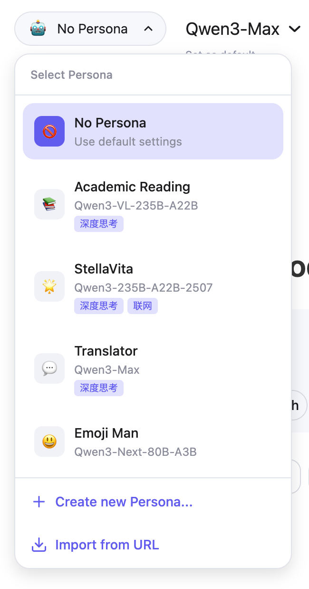
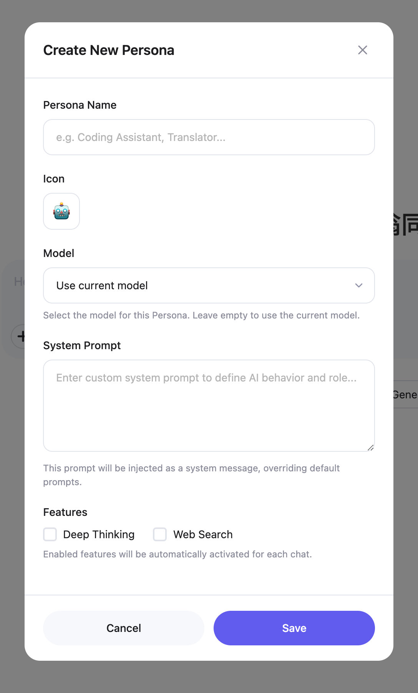

# Qwen Persona

[我看不懂英文](README.md)

A Tampermonkey script for customizing, saving, and syncing user-defined personas in Qwen Chat.

<p align="center">
  
  
</p>

## Installation

> [!WARNING]
> **Note for users in China**: Qwen recently seems to be **randomly rolling out a new UI update overseas**. This script is based on the new version by default.
> If you are in China and haven't received the new UI update, please install the [QwenPersona (Domestic)](https://greasyfork.org/zh-CN/scripts/556914-qwenpersona-domestic) version, **otherwise the script will not be able to inject into the webpage and make modifications.**
> If you want to build the script yourself, **add the `--domestic` parameter** when building after cloning the repository to generate the domestic version. It will be saved to `dist/QwenPersona.domestic.user.js` by default.

1. Install the [Tampermonkey](https://www.tampermonkey.net/) browser extension.
2. Download the script:
    - Install from [GreasyFork](https://greasyfork.org/zh-CN/scripts/556914-qwenpersona) (recommended);
    - Or build it yourself:

     ```bash
     git clone https://github.com/kev1nweng/qwen-persona.git
     cd qwen-persona
     ./build.sh
     ```

     > [!NOTE]
     > Since GreasyFork **does not allow script minification and obfuscation**, the build script has an optional `--gf` parameter to generate unminified plaintext scripts for GreasyFork. By default, the build script generates minified and obfuscated versions to **improve installation speed for users installing via direct URL links.**

    The script will be generated at `dist/QwenPersona.user.js`. Import it via Tampermonkey.
3. Visit [Qwen Chat](https://chat.qwen.ai/) and start using the **custom persona feature!** You can also export your persona configuration and share it across your different devices via URL.

> [!TIP]
> Persona data is stored in `localStorage`. You can export and backup it by running `localStorage.getItem('qwen_personas')` in the browser console.

## Disclaimer

This script is **NOT affiliated with Qwen in any way**; all features are **developed and maintained personally.**

If you believe this script infringes on your rights, **please contact me via GitHub Issues, and I will address it promptly.**
