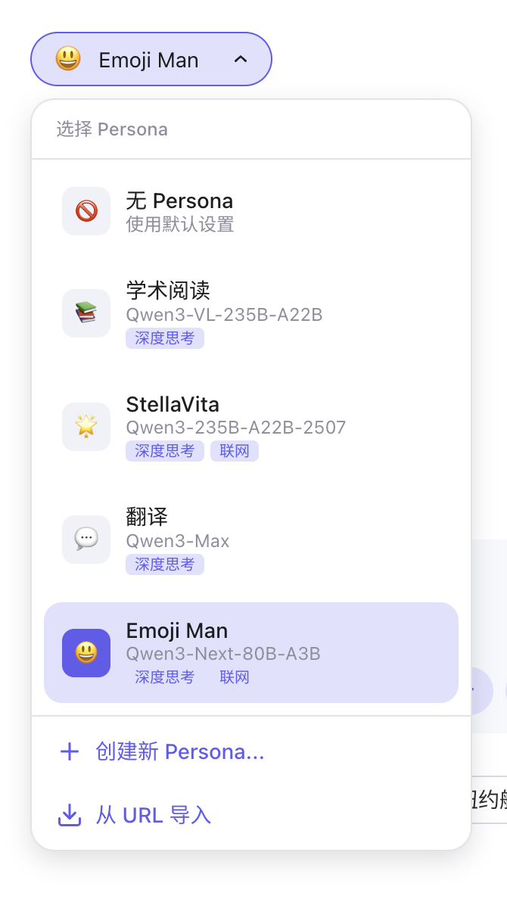
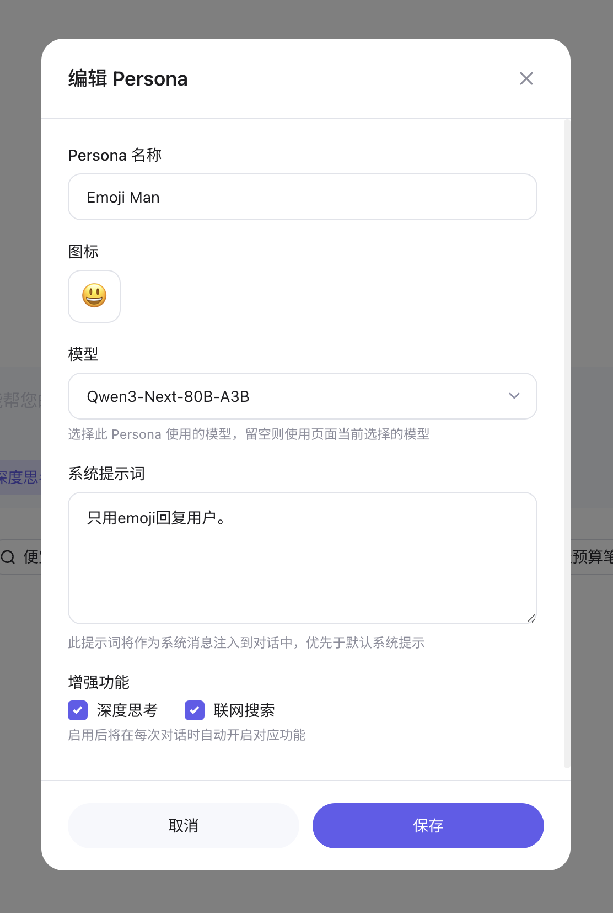

# Qwen Persona

一个便于用户自定义、保存并同步 Qwen Chat 自定义角色的 Tampermonkey 脚本。
A Tampermonkey script for customizing user-defined personas in Qwen Chat.

<p align="center">
  
  
</p>

## 安装 Installation

> [!WARNING]
> **国内用户请注意**：Qwen 近期似乎**在海外随机热推送一个带有新版本 UI 的更新**，该脚本默认基于该新版本。
> 如果您正在国内且没有被推送新 UI 更新，请安装 [QwenPersona (Domestic)](https://greasyfork.org/zh-CN/scripts/556914-qwenpersona-domestic) 版本，**否则脚本无法正常注入网页并作出修改。**
> 如果希望自行构建脚本，请在克隆仓库后构建时**添加 `--domestic` 参数**以生成国内版本脚本，默认保存在 `dist/QwenPersona.domestic.user.js`。

1. 安装 [Tampermonkey](https://www.tampermonkey.net/) 浏览器扩展。
2. 下载脚本：
    - 从 [GreasyFork](https://greasyfork.org/zh-CN/scripts/556914-qwenpersona) 安装脚本（推荐）；
    - 或者自行构建：

     ```bash
     git clone https://github.com/kev1nweng/qwen-persona.git
     cd qwen-persona
     ./build.sh
     ```

     > [!NOTE]
     > 由于 GreasyFork **不允许脚本压缩和混淆**，该构建脚本有一个可选的参数 `--gf` 用于生成适用于 GreasyFork 的未压缩明文脚本。默认情况下，构建脚本会生成压缩和混淆后的版本以**提升 URL 直链用户脚本安装速度。**

    脚本将生成在 `dist/QwenPersona.user.js`，通过 Tampermonkey 导入该文件即可。
3. 访问 [Qwen Chat](https://chat.qwen.ai/) 并开始使用**自定义角色功能！** 您也可以导出自己的角色配置文件并通过 URL 在您的不同设备之间共享。

> [!TIP]
> 角色数据保存在 `localStorage` 中，可以通过在浏览器控制台执行 `localStorage.getItem('qwen_personas')` 来导出和备份。
